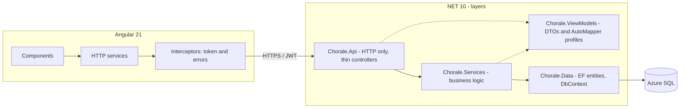
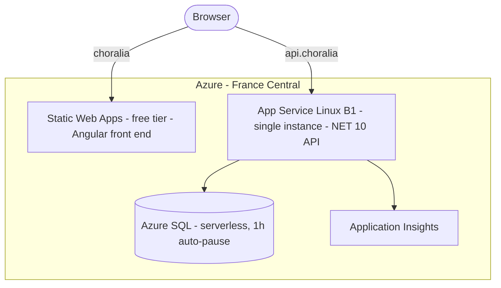
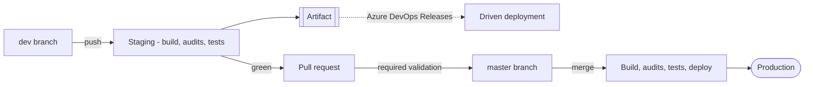

# Choralia

**Choir management application** — repertoire, sheet music, audio recordings, events and
attendance tracking. A personal full-stack project, built and **deployed to production on
Azure**.

---

## 🔗 Live demo

**[choralia-staging.trouve-un-bar.fr](https://choralia-staging.trouve-un-bar.fr)**

Seeded with a full demo dataset — two choirs, a standalone event, and accounts for every role.
Sign in with one of these to explore a different side of the application:

| Role | Email | Password |
|---|---|---|
| Singer — personal space | `chanteur@chorale.local` | `Ch0rale!Singer#2026` |
| Choir manager — management space | `responsable@chorale.local` | `Ch0rale!Manager#2026` |
| Organisation manager | `structure.chorale@chorale.local` | `Ch0rale!Client#2026` |

These are throwaway demo credentials on a demo environment. Please do not treat the data as
meaningful — it is regenerated from a seed.

### Why staging and not production

Production ran on Azure with its own domain, managed TLS certificates, automated deployments
and a serverless database that paused itself between uses. **It has been decommissioned.**

The application has no users yet, and keeping it online cost roughly **€15 per month for a
login screen nobody opened**. I shut it down and kept the parts with lasting value: the code,
the pipelines, and the infrastructure documentation below.

Nothing was abandoned mid-way — the teardown was as deliberate as the build, DNS records
included, so that no subdomain was left pointing at a deleted Azure resource. Redeploying is a
documented, repeatable operation rather than a rediscovery: the resources, the environment
variables and the operational constraints are all written down further down this page.

You can also **[run the whole thing locally](#run-it-locally)** — one command, and the seed
builds the same populated demo.

---

## The problem it solves

An amateur choir runs on sheet music sent by email, section recordings shared through
messaging apps, and attendance tracked in a spreadsheet. Choralia brings all of it together
under one structural constraint: **the same person can belong to several ensembles with
different roles**, and must never see content from an ensemble they do not belong to.

### Four spaces, four roles

| Space | For whom | Content |
|---|---|---|
| `/me` | The singer | Their repertoire, their sheet music by voice part, recordings, attendance |
| `/management/:spaceId` | Choir manager, section leader | Members, songs, sheet music, events |
| `/client/:clientId` | Organisation manager | Consolidated view across the ensembles of one organisation |
| `/admin` | Internal operator | General administration, audit trail, accounts |

---

## Run it locally

**Prerequisites**: .NET 10 SDK, Node 22+, SQL Server (Express is enough).

```bash
cd ChoraleBack/Chorale.Api
cp appsettings.Development.example.json appsettings.Development.json
dotnet run
```

```bash
cd ChoralFront
npm install
npm start
```

The database is **created and migrated automatically** on first run. No SQL script to run, no
schema to import.

### The seed gives you a working demo, not an empty shell

In `Development`, startup seeds a complete dataset: **two choirs under one organisation, a
standalone event under another, and fifteen accounts covering every role** — managers, four
section leaders, singers, event organisers, participants, organisation managers. Songs, voice
parts and events are seeded too, with event dates expressed as an offset from the seed date so
the demo never ages into the past.

Account emails live in `ChoraleBack/Chorale.Api/appsettings.json` under `Seed:Demo`; the shared
password is one you choose in `appsettings.Development.json`. Log in as
`responsable@chorale.local` to see the management side, `chanteur@chorale.local` for the
singer's view.

`appsettings.Development.example.json` is versioned and documents every expected key. The real
file is not, and never should be.

---

## Stack

| Layer | Technology |
|---|---|
| API | **.NET 10** / ASP.NET Core, EF Core, ASP.NET Identity, Serilog, AutoMapper |
| Database | **Azure SQL** (SQL Server) |
| Web | **Angular 21** — standalone components, Signal API, SCSS, functional guards and interceptors |
| Mobile | Ionic Angular *(specified, not started)* |
| CI/CD | **Azure Pipelines** |
| Hosting | **Azure** — App Service, serverless Azure SQL, Static Web Apps |

**Size**: 18 controllers · 50 services · 23 entities · 69 Angular components · 13 business
specification documents.

---

## Application architecture



The separation is strict: **no business rule in a controller**, no direct `DbContext` access
from the API layer, no DTO leaking into the data layer.

---

## How it was hosted



Front end and API lived on **two distinct domains**, so calls were cross-origin and the allowed
origin came from configuration. TLS certificates were Azure-managed and auto-renewed; HTTPS was
enforced.

### Hosting trade-offs

| Decision | Why |
|---|---|
| **Serverless database with auto-pause** | The app is used a few hours a week. Paying for a server around the clock made no sense: the database sleeps, and only storage is billed |
| **App Service B1, single instance** | Three mechanisms depend on it: EF migrations at startup, uploaded files on persistent disk, Data Protection keys. Scaling to two instances would break all three **silently** — documented and deliberate |
| **Static Web Apps, free tier** | The front end is fully static. The free tier covers custom domain and certificate |
| **No `appsettings.Production.json`** | Production configuration came from App Service environment variables. **No secret has ever existed in this repository** |

Running cost was **about €15–18 per month**, dominated by the B1 plan, with a budget alert to
catch any drift.

---

## CI/CD



| Pipeline | Branch | Effect |
|---|---|---|
| Back / front **staging** | `dev` | Builds, audits, tests, publishes an artifact. **Deploys nothing** |
| Back / front **prod** | `master` | Same, then **deploys** |

**Build steps live in shared templates** used by both branches. That is not cosmetic: it is the
only guarantee that *what is validated on `dev` is exactly what ships to production*. Let the two
chains drift apart and the staging chain becomes decorative.

Three gates live in those templates, so they apply to both branches:

| Gate | Effect |
|---|---|
| No local configuration committed | Fails if an `appsettings.{Development,Staging,Production,Local}.json` is found in the repository |
| NuGet audit | Fails on High/Critical — **and also fails when the command itself cannot run**, so a broken gate is never mistaken for a green one |
| `npm audit --audit-level=high` | Fails on High/Critical on the front end |

**Direct pushes to `master` are rejected by branch policy.** Every change goes through `dev`
first, where the staging pipelines validate it on a branch that deploys nothing, then through a
pull request whose validation builds must be green before it can reach `master` and trigger a
release.

Note which pipelines guard the pull request: the **staging** ones, not the production ones.
Opening a pull request must never be able to deploy anything.

---

## Notable engineering decisions

The decisions whose *why* cannot be guessed from reading the code.

**Resilience against a sleeping database.** The serverless tier pauses the database after an
hour of inactivity, and waking it takes 30 to 60 seconds. EF migrations run at API startup, so
without connection resilience any redeployment following a quiet period failed at boot.
`EnableRetryOnFailure` fixes that — but it **forbids manually opened transactions**, which
forced the project's single transactional block through EF Core's execution strategy.

**Enums stored as integers, never as strings.** The ordinal is persisted data, and it is
duplicated on the front end: reordering an enum would silently change the meaning of existing
rows. A dedicated test fails the build if an existing ordinal changes.

**Soft delete throughout.** No physical `DELETE`: entities carry `IsDeleted` and reads filter on
it. A choir's history does not vanish on a misclick.

**Pagination required on every list.** A generic `PagedListViewModel<T>`, never a full load — the
cheapest performance debt is the one never taken on.

**Data Protection keys persisted outside the container.** They encrypt the tokens carried by
invitation and activation links sent by email. Stored on a non-persistent path, they would be
regenerated on every deployment and **every link already in circulation would become
unreadable**.

**SPA routing with explicit exclusions.** The Static Web Apps configuration rewrites deep routes
to `index.html` but **excludes** asset folders. Without that exclusion a missing icon would
return `index.html` with a 200 status instead of a 404 — and the icon component, which trusts
what it receives, would inject the whole page into the DOM.

**Per-endpoint rate limiting.** Sensitive routes — login, forgotten password, account activation
— carry far stricter quotas than the rest of the API.

---

## Quality

| | |
|---|---|
| Backend tests | **1,123** NUnit tests |
| Frontend tests | **308** Vitest tests |
| Lint | ESLint across the whole front end, blocking in CI |
| Security | OWASP Top 10 handled by review: authorisation by role **and** by space, data isolation between ensembles, security headers, path traversal protection on uploaded files |

Backend tests focus on **business rules and negative cases** — access denied, soft-deleted
entities that must not surface, uniqueness conflicts — rather than plumbing.

---

## Known limitations

Honest about what is unfinished:

- **Uploaded files lived on the App Service disk**, capped at 10 GB. Fine for PDF sheet music,
  eventually insufficient for audio recordings → Blob Storage migration was the next step
- **Single instance by design.** Horizontal scaling requires addressing the three dependencies
  listed above
- **Mobile application not started** — the Ionic Angular target is specified, not written
- **Initial bundle at 619 kB**, above the 500 kB warning budget
- **Email delivery was never validated end to end** in production, so the invitation and account
  activation journeys are unproven outside local development

---

## Repository layout and documentation

| Path | Contents |
|---|---|
| `ChoraleBack/` | .NET solution — `Api`, `Services`, `Data`, `ViewModels`, `Common`, `Test` |
| `ChoralFront/` | Angular application |
| `ChoraleMobile/` | Ionic Angular target — specification only, no code yet |
| `Spec/chorale/` | Business specification, 13 numbered documents |
| `docs/` | Web architecture and role matrix |
| `tools/sync-vitrine.py` | Publishes this repository from the private working repository, with a secret scan that refuses to hand back control on a doubt |

> **Note**: the specification documents, the code comments and the business vocabulary are in
> **French** — the domain is a French choir and the terminology is part of the model. Code
> identifiers are English throughout, without exception; that rule is enforced in the
> contributor guidelines.
